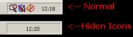



## Hide All Tray Icons

### Description

Hide all icons from the system tray and put in it your own window!.
 
### More Info
 

             |
---                |---
**Submitted On**   |2002-05-23 12:25:32
**By**             |[MaRiØ G\. Serrano](https://github.com/Planet-Source-Code/PSCIndex/blob/master/ByAuthor/mari-g-serrano.md)
**Level**          |Advanced
**User Rating**    |4.3 (17 globes from 4 users)
**Compatibility**  |VB 6\.0
**Category**       |[Windows API Call/ Explanation](https://github.com/Planet-Source-Code/PSCIndex/blob/master/ByCategory/windows-api-call-explanation__1-39.md)
**World**          |[Visual Basic](https://github.com/Planet-Source-Code/PSCIndex/blob/master/ByWorld/visual-basic.md)
**Archive File**   |[Hide\_All\_T861795232002\.zip](https://github.com/Planet-Source-Code/mari-g-serrano-hide-all-tray-icons__1-35025/archive/master.zip)

